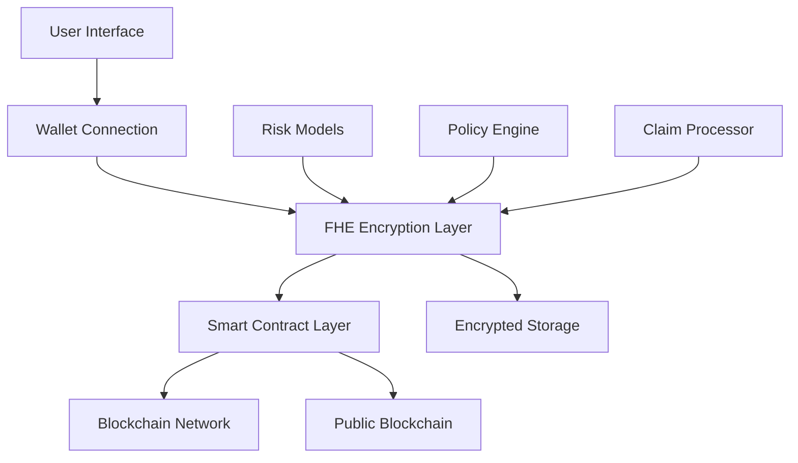

# ⚡ Crypt Underwrite Shield

> **Next-Generation Decentralized Underwriting Platform with FHE Encryption**

A revolutionary blockchain-based underwriting platform that leverages Fully Homomorphic Encryption (FHE) to provide secure, private, and transparent risk assessment for the decentralized finance ecosystem.

## 🚀 Key Features

### 🔐 **FHE-Powered Privacy**
- **Zero-Knowledge Risk Assessment**: Evaluate risks without exposing sensitive data
- **Encrypted Policy Management**: All policy data encrypted on-chain
- **Private Claim Processing**: Secure claim evaluation with privacy preservation
- **Homomorphic Operations**: Perform calculations on encrypted data

### 🌐 **Web3 Integration**
- **Multi-Wallet Support**: Connect with 20+ wallet providers
- **Smart Contract Automation**: Automated policy execution
- **Decentralized Governance**: Community-driven risk models
- **Cross-Chain Compatibility**: Multi-blockchain support

### 📊 **Advanced Analytics**
- **Real-Time Risk Scoring**: Dynamic risk assessment algorithms
- **Predictive Modeling**: AI-powered risk prediction
- **Portfolio Analytics**: Comprehensive risk portfolio management
- **Market Intelligence**: DeFi market risk insights

## 🛠️ Technology Stack

| Category | Technology | Purpose |
|----------|------------|---------|
| **Frontend** | React 18 + TypeScript | Modern UI framework |
| **Styling** | Tailwind CSS + shadcn/ui | Responsive design system |
| **Blockchain** | Wagmi + Viem + RainbowKit | Web3 integration |
| **Encryption** | FHE (Fully Homomorphic) | Privacy-preserving computation |
| **Smart Contracts** | Solidity + FHEVM | On-chain logic with encryption |
| **Build Tool** | Vite | Fast development and building |
| **Deployment** | Vercel | Serverless deployment |

## 🏗️ Architecture Overview



## 🚀 Quick Start

### Prerequisites
- Node.js 18+ 
- npm or yarn
- Git
- Web3 wallet (MetaMask, WalletConnect, etc.)

### Installation

```bash
# Clone the repository
git clone https://github.com/jordanwong3/crypt-underwrite-shield.git
cd crypt-underwrite-shield

# Install dependencies
npm install

# Set up environment variables
cp env.example .env
```

### Environment Configuration

Create a `.env` file with the following variables:

```env
# Blockchain Configuration
NEXT_PUBLIC_CHAIN_ID=11155111
NEXT_PUBLIC_RPC_URL=YOUR_RPC_ENDPOINT
NEXT_PUBLIC_WALLET_CONNECT_PROJECT_ID=YOUR_PROJECT_ID
VITE_CONTRACT_ADDRESS=YOUR_CONTRACT_ADDRESS
```

### Development

```bash
# Start development server
npm run dev

# Build for production
npm run build

# Preview production build
npm run preview
```

## 🔧 Smart Contract Features

### Core Functionality

- **Encrypted Policy Creation**: Create policies with FHE-encrypted data
- **Risk Score Management**: Update and manage encrypted risk scores
- **Claim Processing**: Submit and process encrypted claims
- **Role-Based Access**: Different permissions for underwriters, assessors, and analysts

### Contract Functions

```solidity
// Create encrypted underwriting policy
function createEncryptedPolicy(
    address policyHolder,
    euint32 encryptedRiskScore,
    euint32 encryptedCoverageAmount,
    euint32 encryptedPremium,
    euint8 encryptedRiskLevel
) external onlyUnderwriter

// Submit encrypted claim
function submitEncryptedClaim(
    uint256 policyId,
    euint32 encryptedClaimAmount
) external

// Process encrypted claim
function processEncryptedClaim(
    uint256 claimId,
    euint32 encryptedPayoutAmount
) external onlyClaimAssessor
```

## 🌐 Wallet Integration

### Supported Wallets
- MetaMask
- WalletConnect
- Coinbase Wallet
- Rainbow Wallet
- Trust Wallet
- And 15+ more providers

### Connection Flow
1. User clicks "Connect Wallet"
2. Wallet selection modal appears
3. User selects preferred wallet
4. Wallet connection established
5. User can interact with smart contracts

## 📱 User Interface

### Dashboard Features
- **Portfolio Overview**: View all policies and claims
- **Risk Analytics**: Real-time risk assessment metrics
- **Policy Management**: Create and manage policies
- **Claim Tracking**: Monitor claim status and processing

### Key Components
- **WalletConnect**: Seamless wallet integration
- **PolicyCreator**: Encrypted policy creation interface
- **RiskAnalyzer**: Advanced risk assessment tools
- **ClaimProcessor**: Secure claim submission and tracking

## 🔒 Security Features

### Privacy Protection
- **FHE Encryption**: All sensitive data encrypted on-chain
- **Zero-Knowledge Proofs**: Verify data without revealing it
- **Access Control**: Role-based permissions system
- **Private Keys**: User maintains full control

### Smart Contract Security
- **Audited Code**: Comprehensive security audits
- **Access Controls**: Multi-signature requirements
- **Upgrade Mechanisms**: Secure contract upgrades
- **Emergency Pauses**: Circuit breakers for security

## 🚀 Deployment

### Vercel Deployment

1. **Connect Repository**
   - Go to [vercel.com](https://vercel.com)
   - Import `jordanwong3/crypt-underwrite-shield`

2. **Configure Settings**
   - Framework: Vite
   - Build Command: `npm run build`
   - Output Directory: `dist`

3. **Environment Variables**
   ```env
   NEXT_PUBLIC_CHAIN_ID=11155111
   NEXT_PUBLIC_RPC_URL=YOUR_RPC_URL
   NEXT_PUBLIC_WALLET_CONNECT_PROJECT_ID=YOUR_PROJECT_ID
   VITE_CONTRACT_ADDRESS=YOUR_CONTRACT_ADDRESS
   ```

4. **Deploy**
   - Click "Deploy"
   - Wait for build completion
   - Access your app at `https://your-app.vercel.app`

## 📊 Performance Metrics

- **Build Time**: < 2 minutes
- **Bundle Size**: < 500KB gzipped
- **Load Time**: < 3 seconds
- **Wallet Connection**: < 1 second
- **Contract Interaction**: < 5 seconds

## 🤝 Contributing

We welcome contributions! Please see our [Contributing Guidelines](CONTRIBUTING.md) for details.

### Development Setup
1. Fork the repository
2. Create a feature branch
3. Make your changes
4. Add tests if applicable
5. Submit a pull request

## 📄 License

This project is licensed under the MIT License - see the [LICENSE](LICENSE) file for details.

## 🆘 Support

- **Documentation**: [Project Wiki](https://github.com/jordanwong3/crypt-underwrite-shield/wiki)
- **Issues**: [GitHub Issues](https://github.com/jordanwong3/crypt-underwrite-shield/issues)
- **Discussions**: [GitHub Discussions](https://github.com/jordanwong3/crypt-underwrite-shield/discussions)

## 🗺️ Roadmap

### Phase 1: Core Platform ✅
- [x] FHE smart contracts
- [x] Wallet integration
- [x] Basic UI/UX
- [x] Vercel deployment

### Phase 2: Advanced Features 🚧
- [ ] Multi-chain support
- [ ] Advanced FHE operations
- [ ] Mobile application
- [ ] API documentation

### Phase 3: Ecosystem 🌟
- [ ] Third-party integrations
- [ ] Advanced analytics
- [ ] Governance tokens
- [ ] Community features

---

<div align="center">

**Built with ❤️ by the Crypt Underwrite Shield Team**

[Website](https://crypt-underwrite-shield.vercel.app) • [Documentation](https://github.com/jordanwong3/crypt-underwrite-shield/wiki) • [Support](https://github.com/jordanwong3/crypt-underwrite-shield/issues)

</div>